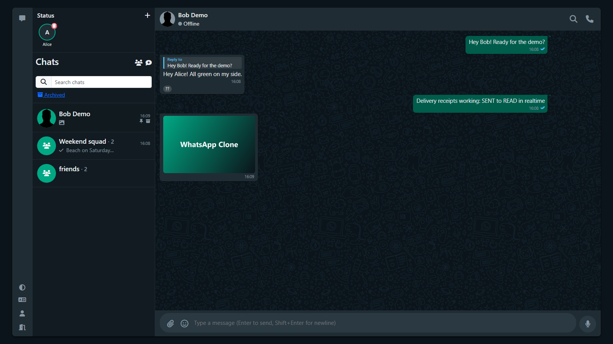

# WhatsApp Clone — Realtime Messaging API

Small whatsapp-like backend with realtime delivery (SENT → DELIVERED → READ).

[](https://github.com/MahmoudYoussef-web/whatsapp-clone-realtime-api/actions/workflows/build.yml)



## What is this

WhatsApp-style clone I built to learn Spring Boot + websockets. Backend is Spring Boot with Postgres, Redis, MinIO and Keycloak. The main thing I tried to get right is message delivery (SENT → DELIVERED → READ).

How it works in short:

- Files go straight to MinIO, API returns presigned URLs (15 min)
- Auth with Keycloak JWT, STOMP token on CONNECT frame
- Unread counters via atomic SQL updates
- Cursor pagination on message id (`before` + `limit`)
- Flyway owns the schema, Hibernate validates on boot
- More details in `docs/decisions/` and `docs/api.md`

## Features

- Private chats + group chats (admins, avatar, leave)
- Text, reply, edit (15 min window), delete (me / everyone), forward
- Media upload (image/video/audio/file) with thumbnails
- Reactions, pin/archive, in-chat search
- Status stories (24h expiry), typing indicators, presence (Redis)
- 1:1 voice calls signaling over STOMP (WebRTC, STUN/coturn)
- Rate limiting 60 mutating req/min, Swagger UI, Actuator health

Full endpoint list: `docs/api.md`

## Getting Started

Need Java 17+, Maven, Docker.

```bash
docker compose up -d
```

Starts Postgres (5432), Keycloak (9090, demo users alice/bob), MinIO (9000/9001), Redis (6379), coturn (3478). Copy `.env.example` to `.env` to change ports.

Backend:

```bash
cd whatsappclone
mvn spring-boot:run
```

API: `http://localhost:8080`, Swagger: `http://localhost:8080/swagger-ui/index.html`

Frontend (optional):

```bash
cd whatsapp-clone-ui
npm install
npm start
```

## Testing

```bash
cd whatsappclone
mvn verify
```

77 unit + 7 integration tests (Testcontainers, needs Docker).

## Project Structure

```
whatsapp-clone-main/
├── whatsappclone/          # Spring Boot backend
├── whatsapp-clone-ui/      # Angular 19 frontend
├── docs/decisions/         # design notes
├── docs/api.md             # endpoint list
├── docs/screenshots/
└── docker-compose.yml
```

## Known limitations

- No end-to-end encryption, server stores plaintext
- Read receipts are per-conversation, not per-message
- One WS connection per user (second tab kicks first)
- No multi-device sync, no resumable uploads
- CSRF disabled + open CORS, dev setup only

## Author

Mahmoud Youssef — https://github.com/MahmoudYoussef-web
